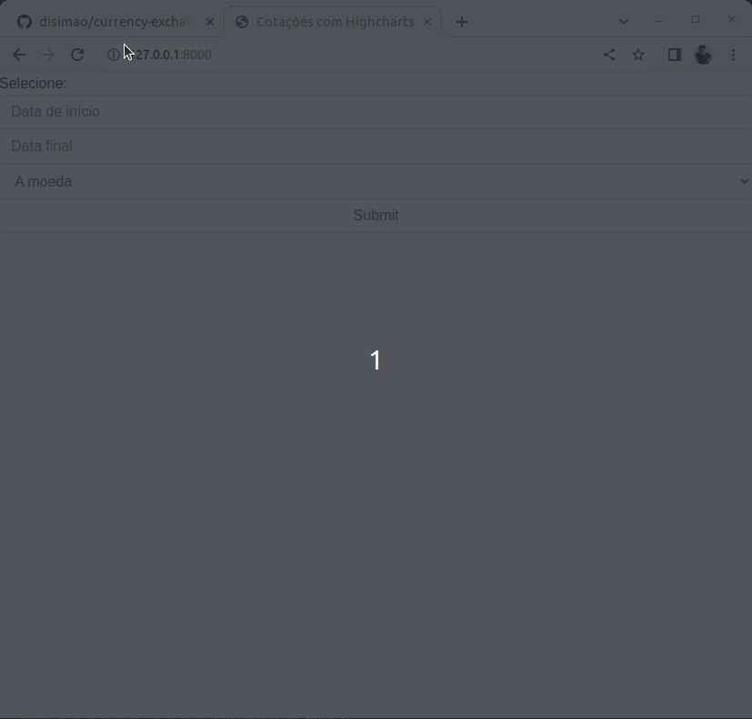

# currency-exchange-rates

## Resolução avançada



O que foi feito para **guardar** as cotações:

  * Disponibilizado banco de dados próprio para aplicação (banco não-relacional)

Como ficou o processo de automação que guarda as cotações:

  * Com rotina automatizada de consulta ao endpoint de cotações que capturou todos os dados (excluindo valores de sabádo e domingo) e fez a persistência (gravação) no banco de dados.
    * ```$ python manage.py populated_db```

Moedas escolhidas:

  * As consultas feitas na API de cotações foram tratadas e os valores de cotações obtidas além de USD, BRL, EUR e JPY foram excluídos da operação de persistência.

## Bônus

  * A API de exibição de **dados gravados** foi feita com Django Rest Framework.
    * ```http://127.0.0.1:8000/rates/?start_date=2020-04-01&end_date=2020-04-06```

## Docker Setup

Setup para MongoDB com propósito de desevenvolvimento.

	$ docker-compose -f ./dev-ops/docker-compose.yaml up

## Python Setup

Setup para exibir o sistema com gráfico.

	$ python3.10 -m venv .venv

	$ source .venv/bin/activate

	$ pip install --upgrade setuptools

	$ pip install --upgrade pip

	$ pip install -r requirements.txt

	$ python manage.py runserver

### Testing

	$ python manage.py test --settings=currency_exchange_rates.settings.unit_tests 
